# Bike-Inventory-SQL-Project

## Tables in the Database
- Brands: Stores information about different bike brands available in the inventory.
- Customers: Contains details of customers, including their names and contact information.
- Categories: Defines product categories, such as Mountain Bikes, Road Bikes, and Accessories.
- Order_items: Records individual products within each order, including quantity and price details.
- Orders: Stores customer orders, including order dates and associated customer IDs.
- Products: Contains details of all available products, including names, prices, and category IDs.
- Staffs: Includes information about employees managing sales and store operations.
- Stocks: Tracks product inventory levels across different stores.
- Stores: Maintains details of all store locations, including names and addresses.

### Project Overview
---
This data analysis project was undertaken to enhance my SQL querying skills while providing valuable insights into the sales performance of bike stores. By analyzing customer purchasing patterns and product trends, the project enables data-driven decision-making and strategic recommendations. Additionally, it offers a deeper understanding of store performance, helping optimize sales and inventory management.

### Skills Demonstrated
--- 
Crafting effective and optimized SQL queries

### Data Sources
---
The dataset for this analysis is stored in CSV files within the Data folder.

### Tools Used
---
MySQL for querying and data analysis.

## Data Analysis
This section highlights key SQL queries used in the analysis and provides a concise summary of the insights derived from the data.

## Potential Business Questions

### 1.Customer Database

### 2.You need to provide customer firstname, lastname and email id

### 3.Retrieve bike details based on a specific brand

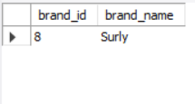

### 4.Get the total number of orders placed

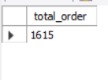

### 5.Retrieve details of all items in a specific order (e.g., order_id = 1)

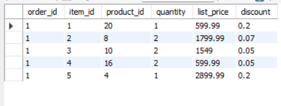

### 6.Find the total number of customers

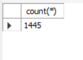

### 7.Retrieve all orders placed in the year 2016

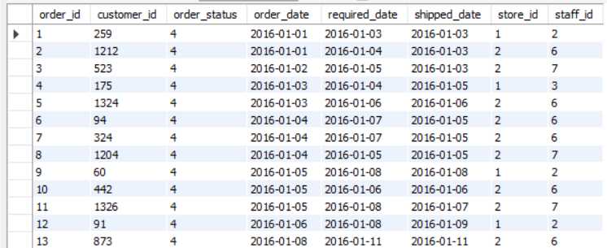

### 8.Retrieve all products along with their brand names

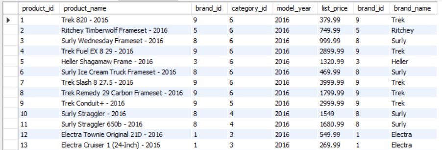

### 9.Find all customers who have placed an order, along with their order details

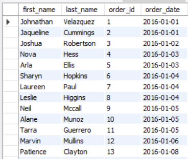

### 10.List all products along with their category names

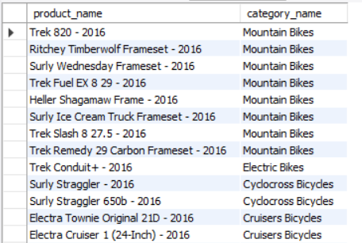

### 11.Find which store has sold the most orders.

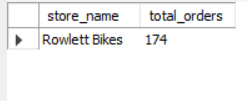

### 12.Show the most expensive products first.

### 13.List the most recent orders.

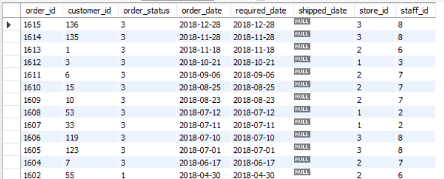

### 14.Find the top 10 best-selling products

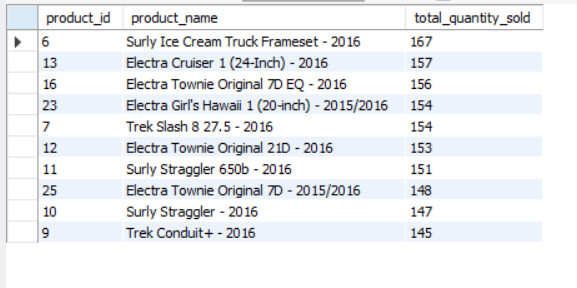

### 15.Get all products that belong to a specific category (e.g., "Mountain Bikes")

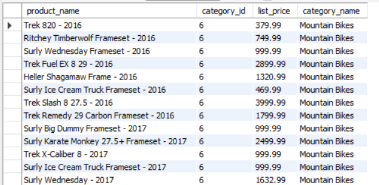

### 16.Find the Top 10 Best-Selling Products

### 17.Calculate the Total Revenue Generated

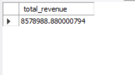

### 18.Get the Total Quantity of Each Product Sold

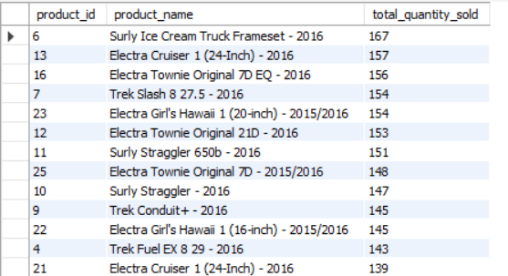
